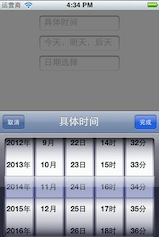
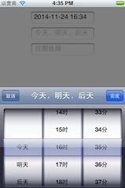
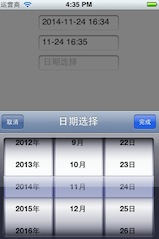

DateTimePicker
===========

在 [BKDate_Time_Year_PickerView](https://github.com/bhavya-kothari/BKDate_Time_Year_PickerView)基础上定制UIView作为DateTimePicker。为了多态初始化时添加了枚举（几个时间选择器样式）。

What you need
---
* [DateTimePickerView.h](https://github.com/Ericfengshi/DateTimePicker/blob/master/DateTimePickerView.h)
* [DateTimePickerView.m](https://github.com/Ericfengshi/DateTimePicker/blob/master/DateTimePickerView.m)

How to use
---  

```objective-c
- (void)viewDidLoad
{
    [super viewDidLoad];
    //...
    
    self.timeDetailTextField = [[[UITextField alloc] initWithFrame:CGRectMake([UIScreen mainScreen].bounds.size.width/4, 10, [UIScreen mainScreen].bounds.size.width/2, 30)] autorelease];
    self.timeDetailTextField.borderStyle = UITextBorderStyleRoundedRect;
    self.timeDetailTextField.placeholder = @"具体时间";
    self.timeDetailTextField.delegate = self;
    self.timeDetailTextField.tag = 1;
    [self.view addSubview:self.timeDetailTextField];
    
    DateTimePickerView *selectDatePicker1 = [[[DateTimePickerView alloc] initWithTitle:@"具体时间" timeType:timeDetail] autorelease];
    selectDatePicker1.delegate = self;
    self.datePicker1 = selectDatePicker1;
        
    self.selectDate = [NSDate date];
    //...
}

#pragma mark -
#pragma mark -textFieldDelegate

- (BOOL)textFieldShouldBeginEditing:(UITextField *)textField{
    
    NSDateFormatter *formater = [[[NSDateFormatter alloc] init] autorelease];
    if (textField.tag == 1) {
        if (![textField.text isEqualToString:@""] && textField.text != nil) {
            [formater setDateFormat:@"yyyy-MM-dd HH:mm"];
            NSDate *resultDate = [formater dateFromString:textField.text];
            self.selectDate = resultDate;
        }else{
            self.selectDate = [NSDate date];
        }
        self.timeType = timeDetail;
        [self.datePicker1 viewLoad:self.selectDate];
        [self.datePicker1 showInView];
    }
    return NO;
}

#pragma mark -
#pragma mark -DateTimePickerView Delegate

-(void)selectDate:(NSString *)result{
    if (result == nil) {
        return;
    }
    NSDateFormatter *formater = [[[NSDateFormatter alloc] init] autorelease];
    if (self.timeType == timeDetail) {
        
        [formater setDateFormat:@"yyyy年MM月dd日 HH时mm分"];
        NSDate *resultDate = [formater dateFromString:result];
        self.selectDate = resultDate;
        [formater setDateFormat:@"yyyy-MM-dd HH:mm"];
        self.timeDetailTextField.text =  [NSString stringWithFormat:@"%@",[formater stringFromDate:self.selectDate]];
        
    }
}
```
Image
---  



